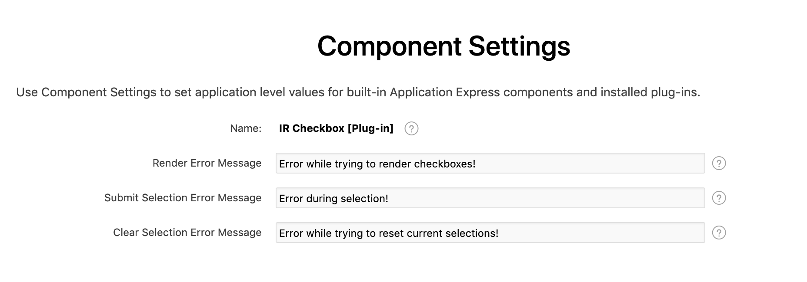

# Interactive-Report-Simple-Checbox

Interactive Report Simple Checkbox APEX Plugin

## Table of Contents

- [Demo](#demo)
- [Features](#features)
- [How to install](#how-to-install)
- [Plugin Settings](#plugin-settings)
    - [Plugin Events](#plugin-events)
    - [Component Settings](#component-settings)
- [Issues](#issues)
- [License](#license)

## Demo
https://apex.oracle.com/pls/apex/f?p=23312

## Release History
1.0 Initial Version

## How to install
Download this repository and install the plug-in into your application by following those steps:
1. Install package `IR_CHECKBOX_UTIL` in Oracle APEX Schema
    * You can find it in folder : `Sources/DB`
1. Install the plugin file `dynamic_action_plugin_com_pretius_apex_contextmenu.sql`
    * You can find it in folder : `Sources`

## Features
* Renders checkboxes for a given column in an Interactive Report.
* Ability to select records and save source value of checkbox column to Apex Collection.
* The plugin can handle a large number of selections, because the values are stored in one large character attribute (CLOB) of apex collection.
* Developers have the possibility to :
    1. Enable/disable selection on row click.
    2. Clear selections of a certain report on page load.
    3. Clear selections of a certain report on change of page items.
    4. Refresh report on change of page items.
* Checkboxes are not rendered if the view is Chart,Pivot or Group by.
* Basic logging for Info Debug Level and advanced logging for App Trace Debug Level.
* Supports Firefox, IE, Edge & Chrome

## How to use
* Create a virtual column or select an existing column and set the static id, which we will later set it in Dynamic Action Settings.
* Disable column options allowing the user to sort, hide , filter etc. like in image below:

* Create a Click Dynamic Action.
* Bind the dynamic action to the Interactive Report for which you want to render checkboxes.
* Select IR Checkbox as the true action.
          * NOTE: Don't disable attribute "Fire on Initialization", the plugin will not be rendered.
* Configure the plugin settings to fit your needs.

## Plugin Settings
You can find a detailed explanation of each attribute in the help section.

## Plugin Events
The plugin exposes one event "Selection Changed [IR Checkbox]" , which is triggered every time the selection is changed and when the selections are cleared by change of page items or page load.

## Component Settings
The plugin also has 3 component settings which allows the developer to change the error messages to be shown to the user.
See image below:

## Issues

## Future developments
* Please let me know any of your wishes

## License

MIT
