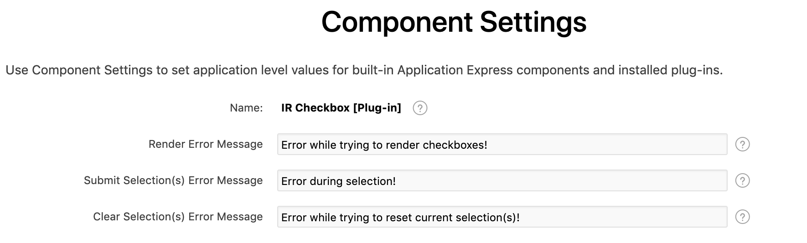

# Interactive-Report-Checbox

Interactive Report Checkbox APEX Plugin

## Table of Contents

- [Demo](#demo)
- [How Demo Page was configured](#how-demo-page-was-configured)
- [Features](#features)
- [How to install](#how-to-install)
- [Plugin Settings](#plugin-settings)
    - [Plugin Events](#plugin-events)
    - [Component Settings](#component-settings)
- [How to Setup IR Selector](#how-to-setup-ir-selector)
- [How to Setup Only IR Display only Checkbox](#how-to-setup-only-ir-display-only-checkbox)
- [Issues](#issues)
- [License](#license)
- [About Author](#about-author)
- [About Kubicek Consulting GmbH](#about-kubicek-consulting-gmbh)

## Demo
https://apex.oracle.com/pls/apex/f?p=23312

## How Demo Page was configured
In GIF below you can see exactly how the demo page for this plugin was configured.

## Release History
1.0 Initial Version
1.1 Implemented fix for Internet Explorer 11.
1.2 Improved the plugin by adding support for rendering of display only checkboxes.

## How to install
Download this repository and install the plug-in into your application by following those steps:
1. Install package `IR_CHECKBOX_UTIL` in Oracle APEX Schema
    * You can find it in folder : `Sources/DB`
1. Install the plugin file `dynamic_action_plugin_de_kc_ir_checkbox.sql`
    * You can find it in folder : `Sources`

## Features
* Renders checkboxes for a given column in an Interactive Report.
* Ability to select records and save source value of checkbox column to Apex Collection.
* The plugin can handle a large number of selections, because the values are stored in one large character attribute (CLOB) of apex collection.
* Developers have the possibility to :
    * Enable/disable selection on row click.
    * Clear selections of a certain report on page load.
    * Clear selections of a certain report on change of page items.
    * Refresh report on change of page items.
* Checkboxes are not rendered if the view is Chart,Pivot or Group by.
* Render display only checkboxes. You have an attribute to specify static ids of columns which you would like to render as display only checkbox. User will be able to filter/sort the report using these columns.
  * NOTE: Source values of these columns should be (Y/N), only these values are recognized by the plugin to set the state of the checkbox as (checked/unchecked).
* Basic logging for Info Debug Level and advanced logging for App Trace Debug Level.

## Plugin Settings
You can find a detailed explanation of each attribute in the help section.

## Plugin Events
The plugin exposes one event "Selection Changed [IR Checkbox]" , which is triggered every time the selection is changed and when the selections are cleared by change of page items.

## Component Settings
The plugin also has 3 component settings which allows the developer to change the error messages to be shown to the user.

## How to Setup IR Selection
* Create a virtual column or select an existing column and set the static id, which we will later set it in DA Plugin Settings.
* Disable column options allowing the user to sort, hide , filter etc. like in image below:

    

* Create a Click Dynamic Action.
* Bind the dynamic action to the Interactive Report Region for which you want to render checkboxes.

    

* Select IR Checkbox as the true action.
    * NOTE: Don't disable attribute "Fire on Initialization", if you do , then the checkboxes will not be rendered on page load.
* Configure the plugin settings to fit your needs.

## How to Setup Only IR Display only Checkbox
* Create a virtual column or select an existing column and set the static id, which we will later set it in DA Plugin Settings. Note: This columns should have source values (Y/N).
* Create a After Refresh Dynamic Action. This is better since we will not need to handle any click actions like we need when we want to also have selection column.
* Bind the dynamic action to the Interactive Report Region for which you want to render checkboxes.

    

* Select IR Checkbox as the true action.
    * NOTE: Don't disable attribute "Fire on Initialization", if you do , then the checkboxes will not be rendered on page load.
* Disable attribute "Enable Selector".
* Add static ids of columns into attribute "Display Column(s)".

## Issues
* Please let me know if you find any.

## Future developments
* Please let me know any of your wishes

## License

MIT

## About Author
Author |Github | E-mail
-------|-------|-------
Dragos Constantin Cotoi | [@kcotoi](https://github.com/kcotoi) | [dragos.cotoi@kubicek-consulting.de](mailto:dragos.cotoi@kubicek-consulting.de)

## About Kubicek Consulting GmbH
Address | Website | E-mail
--------|---------|-------
Stubenwald-Allee 21a, 64625 Bensheim | [https://kubicek-consulting.de](https://kubicek-consulting.de) | [info@kubicek-consulting.de](mailto:info@kubicek-consulting.de)

    

